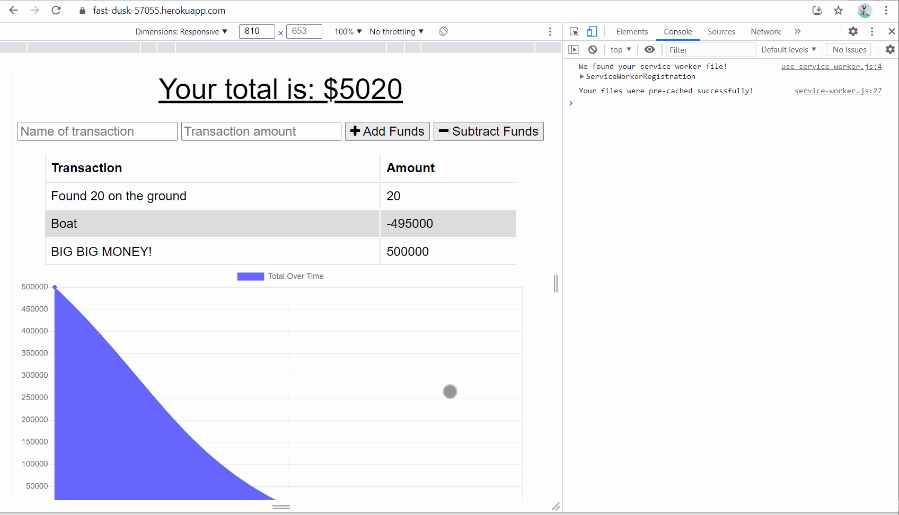

# Progressive Web App Budget Tracker
  -----------------

## Table of Contents
  - [Description](#Description)
  - [Installation Instructions and Getting Started](#Installation)
  - [Built With](#Built)
  - [Technologies Used](#Technologies)
  - [Authors](#Authors)
  - [Acknowledgments](#Acknowledgments)

## Description
This is a budget tracker web app that utilizes progressive web application features! 

Features:
* Track your income and expenditures.
* After an initial load, this app can be used both online and offline.
* Visualize your cashflow with the tracking graph. 

**[Click this link to go to the Progressive Web App Budget Tracker](https://fast-dusk-57055.herokuapp.com/)**.

  

## Installation Instructions and Getting Started
Any modern internet browser will do! Just navigate to **[the webpage](https://fast-dusk-57055.herokuapp.com/)**.

## Built With

* [HTML](https://developer.mozilla.org/en-US/docs/Web/HTML)
* [CSS](https://developer.mozilla.org/en-US/docs/Web/CSS)
* [JavaScript](https://developer.mozilla.org/en-US/docs/Web/JavaScript)
* [Node.js](https://nodejs.org/en/)
* [Express.js](https://expressjs.com/)
* [MongoDB](https://www.mongodb.com/)
* [IndexedDB](https://developer.mozilla.org/en-US/docs/Web/API/IndexedDB_API)
* [Webpack-pwa-manifest](https://www.npmjs.com/package/webpack-pwa-manifest)

## Technologies Used
* [Microsoft Visual Studio Code](https://code.visualstudio.com/)
* [Git Bash](https://git-scm.com/downloads)
* [GitHub](https://github.com/)
* [Insomnia](https://insomnia.rest/)
* [Heroku](https://www.heroku.com/)
* [MongoDB Atlas](https://www.mongodb.com/atlas/database)

## Practices Used
* Agile style User Story and Acceptance Criteria.
* Progressive web application(PWA) practices. 

## Authors
**Alexander Gibson** 

- [Link to Alex's Portfolio Site](https://argibson02.github.io/Professional-Portfolio-3/)
- [Link to Alex's Github](https://github.com/argibson02)
- [Link to Alex's LinkedIn](www.linkedin.com/in/alexander-gibson-1b0bb6105)

## Acknowledgments 😊
- Thanks to Jerome, Manuel, Cheng, and Daniel for instructing the UCB Coding Bootcamp.

